# SoftUni Social Network - frontend

El proyecto abarca el desarrollo de una aplicación web orientada exclusivamente a la comunidad de una institución educativa, como la Universidad Tecnológica Nacional, permitiendo a sus miembros registrarse, crear y administrar su perfil, establecer conexiones con otros usuarios, intercambiar mensajes privados y compartir publicaciones e imágenes dentro del entorno institucional. La plataforma estará enfocada en facilitar la comunicación y la interacción social entre estudiantes y demás integrantes de la universidad, funcionando como un complemento al Campus Virtual tradicional. El proyecto contempla las funcionalidades principales de una red social interna, pero no incluye la gestión académica formal (como inscripción a materias, carga de notas o administración de cursadas), ya que su propósito está centrado en la comunicación y la integración de la comunidad universitaria.

---

## 📌 Tabla de Contenidos

- [Características](#características)
- [Tecnologías](#tecnologías)
- [Requisitos](#requisitos)
- [Instalacion](#despliegue)

---

## 🚀 Características

- Crear nuevo usuario
- Envio de mensajes 
- Solicitud de amistad
- Notificaciones en tiempo real
- Subir imagenes a la seccion del usuario

---

## 🛠 Tecnologías

- React
- Node Package manager 
- Docker
---

## 📋 Requisitos

Antes de ejecutar el proyecto necesitás tener instalado:
- React
- Node Package manager 11+
- Docker / Docker Desktop

## Ejecucion en desarrollo 

Dentro de nuestra terminal de comando, damos de alta la variabole de entorno que apunta al backend
 ```linux
 back_end_uri = <URL DEL BACK END>
 ```
 Luego de ingresar la variable de entorno, ejecutamos el codigo
 ``` linux
 npm start
 ```
 
## ⚙️ Despliegue

 ### Creacion de imagen Docker:

```docker
 docker build -t network_front_v3 .
 ```
 
 ### Creamos etiqueta para el proyecto
 ```docker
 docker tag network_front_v3:latest 766749599583.dkr.ecr.us-east-1.amazonaws.com/social-network-frontend:v3 
 ```

 ### Enviamos imagen creada al servicio de AWS ECR con nuestro usario IAM con permisos anteriormente creado
 ```docker
 docker push 766749599583.dkr.ecr.us-east-1.amazonaws.com/social-network-frontend:v3
 ```

### Verificamos que la imagen ya se encuentra en AWS
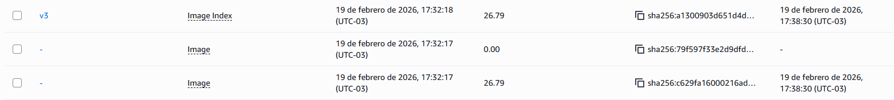

### Creacion de instancias ECS

#### Nos dirigimos hacia el servicio de ECS principalmente a la seccion de "Definicion de tareas" y hacemos clic en "Crear una nueva definicion de tarea"
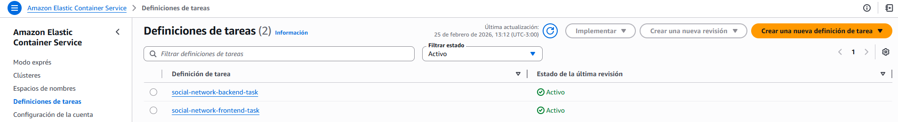

### Llenamos el formulario con los requisitos necesarios 

#### Ingresamos el nombre de la familia que pertenecerá tarea a crear
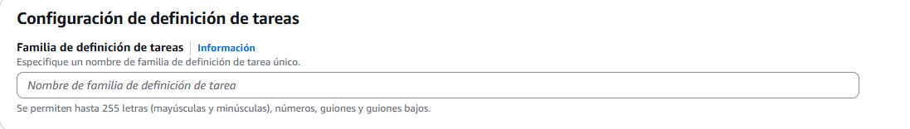

#### La instancia la definimos como tipo Fargate o contenedores si servidor
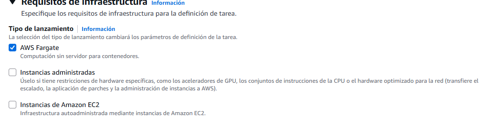

#### Le indicamos la imagen a usar, haciendo en el explorador de imagenes de ECR o copiamos y pegamos la URI de la imagen
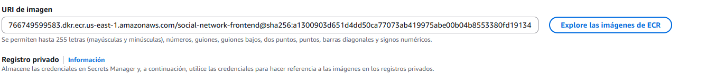

#### ⚠️ !IMPORTANTE: Mapear los puertos en donde se ejecutan las aplicaciones y definirlas en la instancia. En este caso es un codigo escrito en React, por defecto se usa el puerto 3000
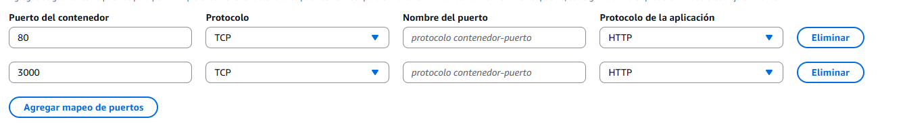

#### ⚠️ !IMPORTANTE: Ingresar las variables de entorno que son necesarias, en este caso la URI que apunta al backned (Se recomienda tener el servicio de Backend deplegado antes que el Frontend)
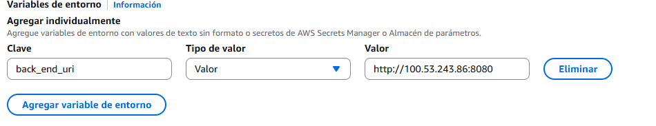

#### ✅ Finalizado estos, podremos hacer clic en "Crear"

### Creacion de Cluster para la ejecucion de las tareas creadas

#### Nos dirigimos a la seccion de "Clusteres" y hacemos click en "Crear cluster"

#### llenamos el fomulario empezando por agregar un nombre 
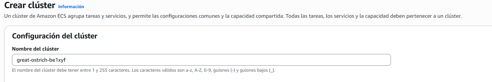

#### Para el tipo de infraestructura volvemos a indicarle que sea solo de tipo "Fargate"
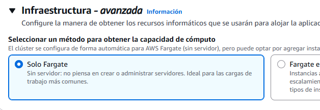

#### ✅ Finalizado esto, podremos hacer clic en "Crear"
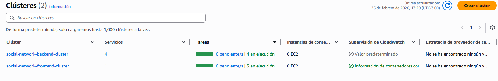

### Definicion de la Tarea a ejecutar en el Cluster.

#### Ingresamos al cluter creado, haciendo click en el nombre dentro de la lista de clusteres creados.
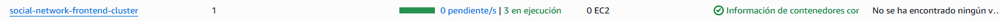

#### Nos dirigimos hacia la seccion de tareas y hacemos clic en "Ejecutar nueva tarea"
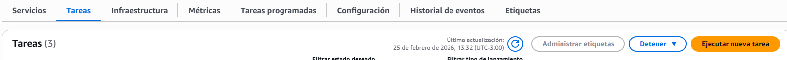

#### Dentro de ese apartado , seleccionamos la familia de tareas a ejecutar
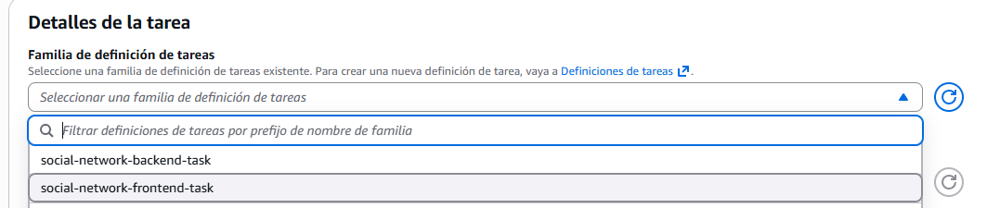

#### La cantidad de tareas a lanzar depende del usuario, en este caso se ejecutará solo una, por lo que solo se creara 1 usa sola puera de enlace publica al servicio
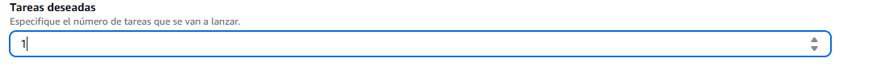

#### ⚠️ Es inportante que en el apartado de red definan bien VPC y la subred en la que se podrá acceder al servicio, en este caso se utlizará la VPC por defecto que viene creada en AWS y la subnet "us-east-1a"
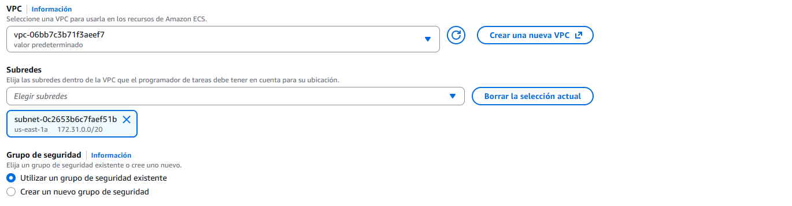

#### ⚠️ Es importante tambien definir a que grupo de seguridad pertenecerá esta instancia, ya que por temas de reglas de firedwall, podriamos tener impedimento el poder acceder al servicio desde internet
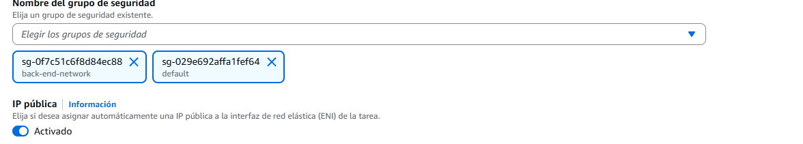

✅ Finalizado esto, podremos hacer clic en el boton de "Crear"
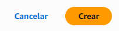

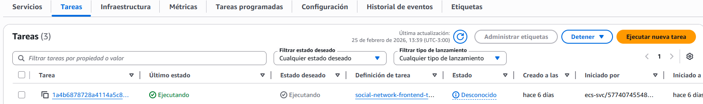ç


✅ Finalizado estos pasos, dentro de la tarea podremos entrar a nuestra web desplegada via la ip publica creada al crear la tarea.

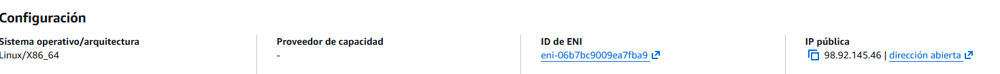
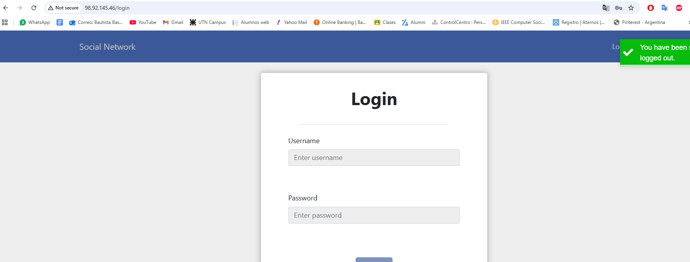